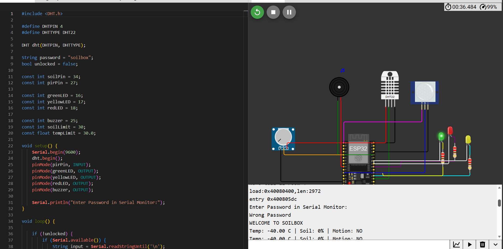
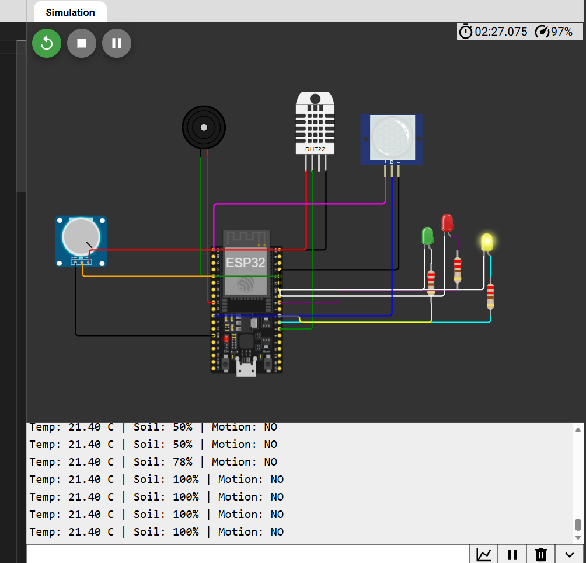
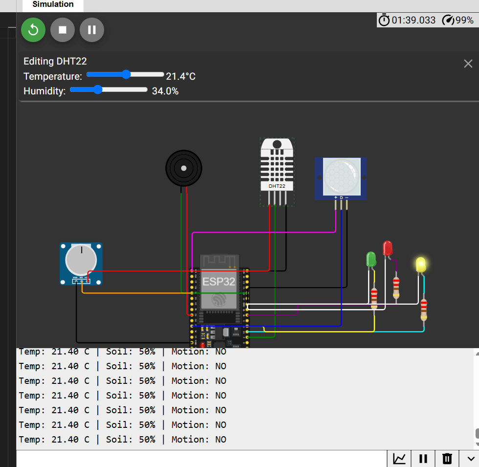
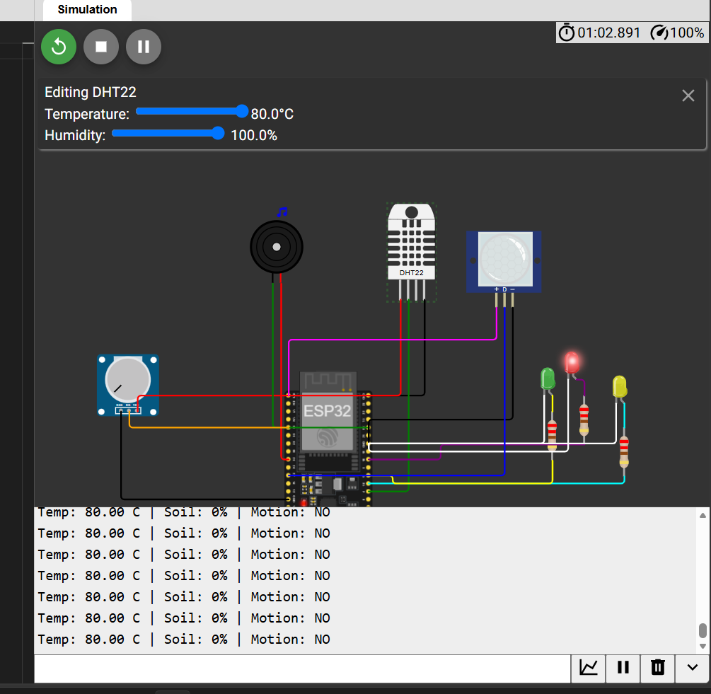
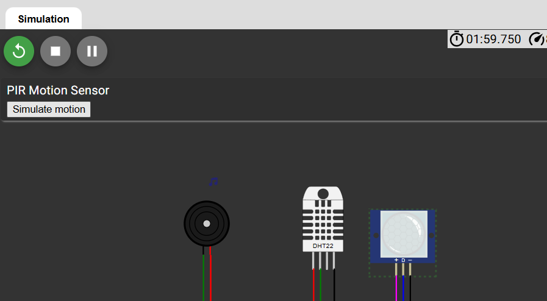

# Smart Agriculture Monitoring System

An ESP32-based smart agriculture monitoring system designed to monitor environmental conditions and simulate soil moisture levels using Wokwi.

## Project Overview

This project uses an ESP32 to collect information from different sensors and provide visual and audible alerts based on the detected conditions.

The system monitors:

- Temperature
- Humidity
- Soil moisture level
- Motion detection

Three LEDs are used to indicate the general condition of the environment, while a buzzer provides alerts when necessary.

For the Wokwi simulation, a potentiometer is used to simulate the output of a soil-moisture sensor.
## Project Preview

### Wokwi Simulation

### Hardware Implementation Concept

## System Architecture

The system is built around an ESP32 microcontroller. It collects data from the DHT22, PIR sensor, and simulated soil-moisture input, then processes the measurements and controls the LEDs and buzzer according to predefined thresholds.

                    ┌─────────────┐
                    │   DHT22     │
                    │Temp/Humidity│
                    └─────┬───────┘
                          │
                          │   
┌──────────────┐     ┌────▼─────┐     ┌──────────────┐
│     PIR      │────►│          │────►│ Green LED    │
│ Motion       │     │          │     │ Yellow LED   │
└──────────────┘     │   ESP32  │     │ Red LED      │
                     │          │     └──────────────┘
┌──────────────┐     │          │
│ Potentiometer│────►│          │────► Buzzer
│ Soil Moisture│     └──────────┘
│ Simulation   │
└──────────────┘ 

## Pin Configuration

| Component | Connection | ESP32 GPIO |
|---|---|---:|
| DHT22 | SDA / Data | GPIO 4 |
| PIR Sensor | OUT | GPIO 27 |
| Potentiometer | Signal | GPIO 34 |
| Green LED | Anode through resistor | GPIO 16 |
| Yellow LED | Anode through resistor | GPIO 17 |
| Red LED | Anode through resistor | GPIO 18 |
| Buzzer | Positive | GPIO 25 |
## Components

- ESP32 DevKit
- DHT22 temperature and humidity sensor
- PIR motion sensor
- Potentiometer (soil-moisture simulation)
- Green LED
- Yellow LED
- Red LED
- 3 × 220Ω resistors
- Buzzer

## System Logic

The ESP32 continuously reads the sensors and evaluates the environmental conditions.

### Soil Moisture

- Green LED → normal soil condition
- Yellow LED → warning condition
- Red LED → dry soil condition

The soil moisture value is simulated using the potentiometer and converted into a percentage.

### Temperature

A temperature above 30°C is considered a high-temperature condition.

### Motion

The PIR sensor detects movement and activates an audible alert.

### Combined Conditions

| Condition | LED | Buzzer |
|---|---|---|
| Normal | 🟢 Green | OFF |
| Temperature high OR soil dry | 🟡 Yellow | ON |
| Temperature high AND soil dry | 🔴 Red | ON |
| Motion detected | Current status | Motion alert |

## Security

The system starts with a simple password-protection mechanism.

The password used in the simulation is:

`soilbox`

The monitoring system starts after the correct password is entered through the Serial Monitor.

## Simulation

The project was developed and tested using Wokwi.

The Wokwi simulation files are included in this repository:

- `diagram.json` — circuit configuration
- `sketch.ino` — ESP32 firmware

## Testing and Results

The system was tested in the Wokwi simulation under different conditions to verify the behavior of the sensors, LEDs, buzzer, and password authentication.

### 1. Password Authentication

The system starts by requesting a password through the Serial Monitor.

The correct password unlocks the monitoring system and displays a welcome message.

**Expected behavior:**
- Correct password → system unlocked
- Incorrect password → access denied
- Green LED briefly turns ON after successful authentication

---

### 2. Normal Conditions

The system was tested under normal environmental conditions.

**Test values:**
- Temperature: 21.4°C
- Soil moisture: 50%
- Motion: No

**Expected behavior:**
- 🟢 Green LED turns ON
- Buzzer remains OFF
- Sensor readings are displayed in the Serial Monitor

---

### 3. Soil Moisture Test

The potentiometer is used to simulate the soil-moisture sensor in the Wokwi environment.

When the soil moisture falls below the 30% threshold, the system detects a dry-soil condition.

**Expected behavior:**
- Soil moisture below 30% → dry soil detected
- 🟡 Yellow LED turns ON when temperature is normal
- 🔊 Buzzer is activated
- Soil moisture value is displayed in the Serial Monitor

---

### 4. Warning Alert

The system was tested with one environmental condition exceeding its defined limit.

**Expected behavior:**
- One abnormal condition is detected
- 🟡 Yellow LED turns ON
- 🔊 Buzzer is activated
- Sensor values are displayed in the Serial Monitor

---

### 5. Critical Alert

The system was tested with both high temperature and low soil moisture at the same time.

**Expected behavior:**
- High temperature is detected
- Dry soil is detected
- 🔴 Red LED turns ON
- 🔊 Buzzer produces a critical alert
- Sensor values are displayed in the Serial Monitor

---

### 6. Motion Detection

The PIR sensor was tested by simulating movement in the Wokwi environment.

**Expected behavior:**
- Motion is detected
- Serial Monitor displays `Motion: YES`
- 🔊 Buzzer is activated
- The LED continues to indicate the current environmental condition

---

## Test Summary

| Test | Condition | Expected Result |
|---|---|---|
| Password Authentication | Correct/incorrect password | Access granted or denied |
| Normal Conditions | Normal temperature and soil moisture | 🟢 Green LED |
| Soil Moisture | Soil moisture below 30% | 🟡 Yellow LED + buzzer |
| Warning Alert | One abnormal condition | 🟡 Yellow LED + buzzer |
| Critical Alert | High temperature + dry soil | 🔴 Red LED + buzzer |
| Motion Detection | PIR detects movement | 🔊 Buzzer alert |

## Conclusion

The Wokwi simulation successfully demonstrated the main functions of the Smart Agriculture Monitoring System. The ESP32 was able to read environmental data, evaluate soil moisture and temperature conditions, detect motion, and provide visual and audible alerts based on the detected conditions.

## Limitations

The main limitations are:

- The potentiometer is used to simulate soil moisture instead of a physical soil-moisture sensor.
- The system does not currently control a real irrigation pump.
- Sensor data is only displayed through the Serial Monitor.
- There is no remote monitoring or cloud connection.
- The password system is a basic local authentication mechanism for the prototype.

## Future Improvements

The project could be extended into a more complete IoT agriculture system by adding:

- A real capacitive soil-moisture sensor.
- Automatic irrigation using a water pump and relay/MOSFET.
- Wi-Fi connectivity using the ESP32.
- A web or mobile dashboard for real-time monitoring.
- Cloud storage for sensor measurements.
- Notifications when soil moisture becomes too low.
- Data logging and historical analysis.
- Multiple soil and environmental sensors for larger agricultural areas.

## Technologies Used

- **ESP32**
- **C++ / Arduino framework**
- **Wokwi**
- **DHT22**
- **PIR motion sensor**
- **Analog input / ADC**
- **Embedded systems**
- **IoT concepts**

  # Author
  Rima Bakini 

