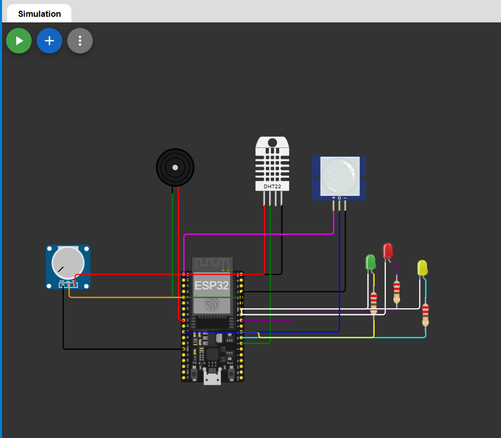

# Smart Agriculture Monitoring System

An ESP32-based smart agriculture monitoring system designed to monitor environmental conditions and simulate soil moisture levels using Wokwi.

## Project Overview

This project uses an ESP32 to collect information from different sensors and provide visual and audible alerts based on the detected conditions.

The system monitors:

- Temperature
- Humidity
- Soil moisture level
- Motion detection

Three LEDs are used to indicate the general condition of the environment, while a buzzer provides alerts when necessary.

For the Wokwi simulation, a potentiometer is used to simulate the output of a soil-moisture sensor.
## Project Preview

### Wokwi Simulation

### Hardware Implementation Concept

## Components

- ESP32 DevKit
- DHT22 temperature and humidity sensor
- PIR motion sensor
- Potentiometer (soil-moisture simulation)
- Green LED
- Yellow LED
- Red LED
- 3 × 220Ω resistors
- Buzzer
## Testing and Results

The system was tested under different environmental and security conditions to verify the behavior of the sensors, LEDs, buzzer, and password system.

### 1. Password Authentication

The system requires a password before monitoring begins.

- Incorrect password → access denied
- Correct password → system unlocked and displays "WELCOME TO SOILBOX"

### 2. temperature Condition 

The DHT22 temperature was increased above the 30°C threshold.

Expected behavior:
- Red LED turns ON
- Buzzer is activated
- Temperature is displayed in the Serial Monitor

### 4 .Soil Moisture condition

The potentiometer is used to simulate the soil moisture sensor. When the soil moisture level falls below 30%, the system detects dry soil.

Expected behavior:
- Soil moisture < 30% → dry soil detected
-  Yellow LED turns ON
-  Buzzer is activated
- The soil moisture value is displayed in the Serial Monitor

### 3. Normal Environmental Conditions

The temperature was set to approximately 21°C and soil moisture to 50%.

Expected behavior:
- Green LED turns ON
- No alarm
- Sensor values are displayed in the Serial Monitor

### 4. Motion Detection

The PIR sensor was triggered using the simulation controls.

Expected behavior:
- Motion is detected
- Buzzer is activated
- Serial Monitor displays `Motion: YES`

## Conclusion

The simulation successfully demonstrates an ESP32-based smart agriculture monitoring system capable of monitoring temperature, soil moisture and motion. The system provides visual and audible alerts when abnormal conditions are detected.
## Pin Configuration

| Component | ESP32 GPIO |
|---|---:|
| DHT22 Data | GPIO 4 |
| PIR OUT | GPIO 27 |
| Soil Moisture / Potentiometer | GPIO 34 |
| Buzzer | GPIO 25 |
| Green LED | GPIO 16 |
| Yellow LED | GPIO 17 |
| Red LED | GPIO 18 |

## System Logic

The ESP32 continuously reads the sensors and evaluates the environmental conditions.

### Soil Moisture

- Green LED → normal soil condition
- Yellow LED → warning condition
- Red LED → dry soil condition

The soil moisture value is simulated using the potentiometer and converted into a percentage.

### Temperature

A temperature above 30°C is considered a high-temperature condition.

### Motion

The PIR sensor detects movement and activates an audible alert.

### Combined Conditions

| Condition | LED | Buzzer |
|---|---|---|
| Normal | 🟢 Green | OFF |
| Temperature high OR soil dry | 🟡 Yellow | ON |
| Temperature high AND soil dry | 🔴 Red | ON |
| Motion detected | Current status | Motion alert |

## Security

The system starts with a simple password-protection mechanism.

The password used in the simulation is:

`soilbox`

The monitoring system starts after the correct password is entered through the Serial Monitor.

## Simulation

The project was developed and tested using Wokwi.

The Wokwi simulation files are included in this repository:

- `diagram.json` — circuit configuration
- `sketch.ino` — ESP32 firmware

## Testing

The system was tested by changing the potentiometer value to simulate different soil-moisture levels and by changing the environmental conditions in the simulation.

The following functions were tested:

- DHT22 temperature readings
- DHT22 humidity readings
- Soil-moisture simulation
- PIR motion detection
- Green, yellow and red LED indicators
- Buzzer alerts
- Password protection
- Serial Monitor output

## Limitations
The current version is a simulation. The potentiometer is used instead of a physical soil-moisture sensor.

The system does not currently control a real irrigation pump or provide remote monitoring.

## Future Improvements
Possible improvements include:

- Replace the potentiometer with a real capacitive soil-moisture sensor
- Add automatic irrigation using a water pump
- Add a relay or MOSFET-based pump control
- Connect the ESP32 to Wi-Fi
- Create a web or mobile monitoring dashboard
- Store sensor measurements for later analysis
- Add notifications when the soil becomes too dry

## Technologies

- ESP32
- C++
- Arduino framework
- Wokwi
- DHT22
- PIR sensor
- ADC
 - Embedded systems

## Testing

The system was tested in the Wokwi simulation to verify the behavior of the sensors, indicators and alarm system.

### 1. Password Authentication

When the system starts, the user must enter the password through the Serial Monitor.

Correct password:

`soilbox`

After successful authentication, the system displays:

`WELCOME TO SOILBOX`

### 2. Temperature and Humidity

The DHT22 sensor is used to measure:

- Temperature
- Humidity

The measurements are displayed through the Serial Monitor.

A temperature above 30°C is considered a high-temperature condition.

### 3. Soil Moisture

A potentiometer is used to simulate a soil-moisture sensor.

The analog value is converted into a percentage.

A soil moisture level below 30% is considered a dry-soil condition.

### 4. LED Indicators

The three LEDs indicate the current environmental condition:

| Condition | LED |
|---|---|
| Normal | 🟢 Green |
| Warning | 🟡 Yellow |
| Critical / Dry soil + high temperature | 🔴 Red |

### 5. Motion Detection

The PIR sensor detects movement.

When motion is detected, the buzzer produces an alert.

### 6. Buzzer Alerts

The buzzer provides different alerts depending on the detected condition:

- High temperature → warning tone
- Dry soil → warning tone
- High temperature + dry soil → critical alert
- Motion detected → motion alert

### Test Result

All implemented functions were successfully tested in the Wokwi simulation, including sensor readings, password authentication, LED indicators and buzzer alerts.
  
  # Author
  Rima Bakini 

## Author
